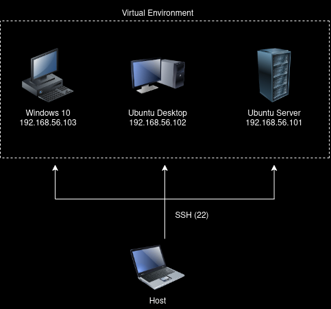

# Home SOC Lab Environment

## Network Diagram

## Tools Used
- VirtualBox
- SSH (secure remote access to Linux VMs)

## Environment
- Host machine connects directly to all 3 VMs via SSH
- 3 VMs: Ubuntu Server, Ubuntu Desktop, Windows 10
- All VMs can communicate with each other

## Changelog

### 2026-05-29
- Initial lab setup (VirtualBox, 3 VMs, SSH)
- Diagram added

### 2026-06-XX (coming soon)
- [ ] pfSense firewall added
- [ ] Suricata IDS/IPS configured
- [ ] TShark packet analysis